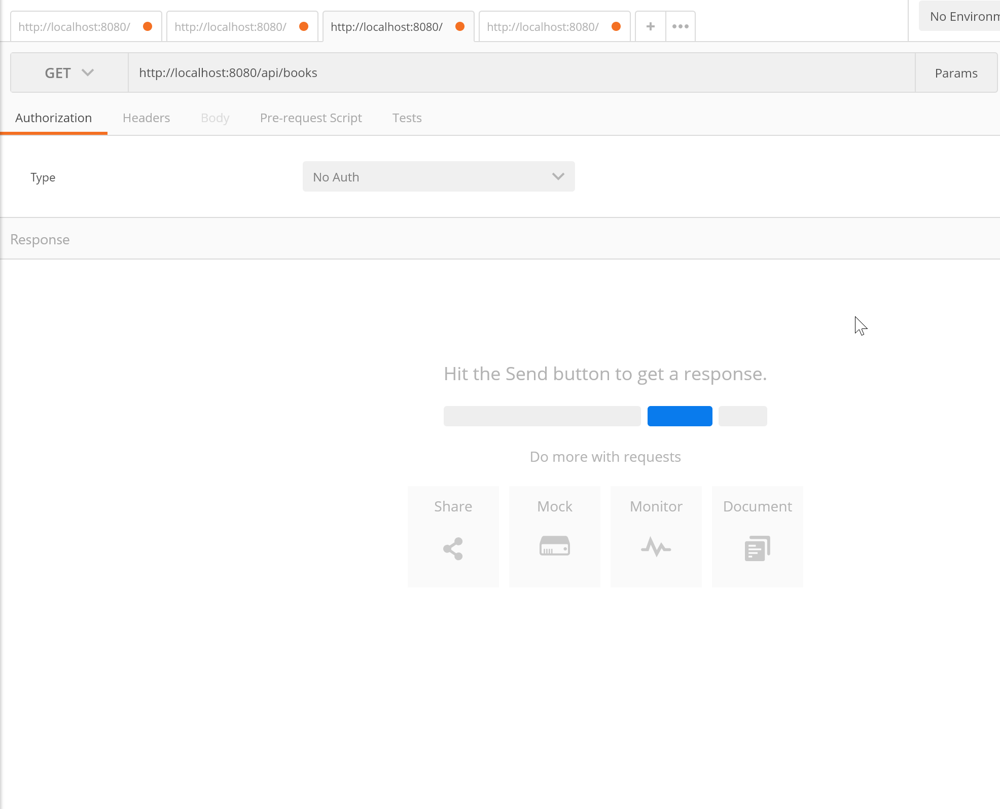

APIのデモ実行手順
====

# 概要
APIのデモの実行手順として、動作環境の構築手順と使用方法を案内します。

## 【動作環境の構築】

### １．java・DB・IDEのインストール
Java・DB・IDEをインストールします。インストール対象は以下の通りです。
インストール過程の設定は、全てデフォルトで大丈夫です。また、バージョンは最新のもので大丈夫です。
- Java SE10
- PostgresSQL  
　※ポートを指定する場合は8080以外  
　※管理者ユーザーID:postgres, パスワード:test  
　※上記と異なるユーザーIDとパスワードを指定する場合は、後ほどダウンロードするソース内のapplication.ymlのIDとパスワードを変更して下さい
- Intellij IDEA

### ２．ソースの取得
このブランチからダウンロードして下さい。ダウンロードしたファイルは、zipファイルなので解凍して下さい。  

### ３．ソースのインポート
Intellij IDEAから、ダウンロードしたソースをインポートします。インポートに当たってのポイントは3点です。
- Gradleプロジェクトとしてインポートする
- Gradleの利用設定は、「Use default gradle wrapper(デフォルトのwrapperを使う)」を選択する
- 依存関係のあるファイルがダウンロードされていることを確認する　　

  インポートするとエディタの下部にウィンドウが開き、依存関係のあるファイルのダウンロードが自動で始まります。このダウンロード結果が、全てOKであることを確認します。

### ４．実行
実行の設定をして、実行します。

## 【操作方法】
このAPIでは、本の情報を登録したり、参照したりすることができます。また、データのやり取りの形式はJSONです。

具体的には、以下の4通りの操作ができます。

１．登録データの全量取得  
　リクエスト  
　　メソッド：GET  
　　パス：http://localhost:8080/api/books  
　レスポンス  
　　ボディ　※イメージ  
　　[  
　　　{  
　　　　"id": 1000,  
　　　　"name": "ジョジョの奇妙な冒険1巻",  
　　　　"author": "荒木飛呂彦",  
　　　　"isbn": "9784344031159"  
　　　},  
　　　{  
　　　　"id": 1001,  
　　　　"name": "キングダム47巻",  
　　　　"author": "原泰久",  
　　　　"isbn": "9784088907017"  
　　　},  
　　]  

２．IDを指定した登録データの取得  
　リクエスト  
　　メソッド：GET  
　　パス：http://localhost:8080/api/books/:id  
　レスポンス  
　　ボディ　※イメージ  
　　[  
　　　{  
　　　　"id": 1000,  
　　　　"name": "ジョジョの奇妙な冒険1巻",  
　　　　"author": "荒木飛呂彦",  
　　　　"isbn": "9784344031159"  
　　　},  
　　]  

3．データの新規登録  
　リクエスト  
　　メソッド：POST  
　　パス：http://localhost:8080/api/books  
　　ボディ　※イメージ  
　　　[  
　　　　{  
　　　　　"id": 1,  
　　　　　"name": "ワンピース",  
　　　　　"author": "織田栄一郎",  
　　　　　"isbn": "9784344031159"  
　　　　},  
　　　]  

4．データの削除  
　リクエスト  
　　メソッド：DELETE  
　　パス：http://localhost:8080/api/books/:id

